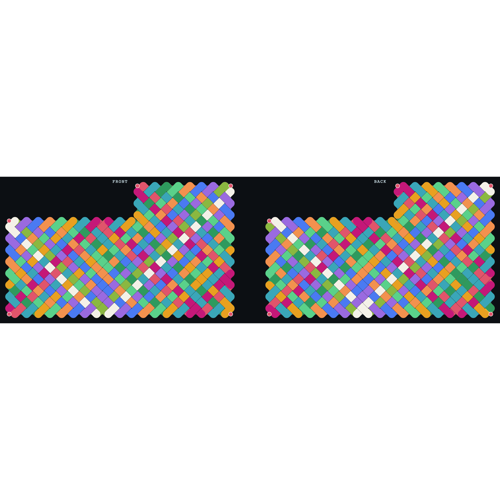

# The two-faced shoe weave: front and back from one flat L

This folder contains a single reproducible run that draws João's boot panel as a woven
cloth on **both faces at once** (front on the left, back on the right) from one flat L
shape, using the billiard-weave engine plus the "corner action" rule the maker described.

It is exploratory research code on the `seam-lab` branch. The flat-weave engine it builds
on is the verified one used by the main app; the seam/3D part is the open problem.



---

## TL;DR (for a collaborator picking this up cold)

- **Image:** `shoe-front-back.png` (source: `shoe-front-back.svg`).
- **Script that made it:** `render-12.mjs` (verbatim copy of `scripts/render-12.mjs` in the repo root).
- **Run it:** from the repo root, `node scripts/render-12.mjs`, then turn the SVG into a PNG with `qlmanage -t -s 2200 -o /tmp /tmp/shoe12.svg` (macOS).
- **What this exact run does:** sets **every convex corner to "go through"** and renders the over/under weave on both faces.
- **What it produces:** the model traces **13 closed cords** for this configuration (the script prints `all corners THROUGH -> 13 cords, all closed: true`). The 12-cord result (the project target) comes from a *different* corner setting, described below.

> Honest note on the count: the central question of the project is how a flat panel that
> is **8 cords** flat becomes a **12-cord** boot when assembled. This particular run is the
> "all corners go through" extreme, which the model counts as **13**, not 12. It is included
> because it is the picture that was confirmed as visually correct. The corner action is the
> lever between counts; see "The corner action" below for the 12 setting.

---

## The pieces, and where they live

| file | role |
|---|---|
| `src/engine.js` (repo) | the **verified** billiard-weave engine (`TearEngine`). Pure functions, treated as ground truth. |
| `scripts/render-12.mjs` (repo) / `render-12.mjs` (here) | the standalone script that traces the cords and draws this image. Self-contained except for `engine.js`. |
| `face.html` + `src/face-trace.js` (repo) | the interactive tool: watch one cord travel across front and back, flip each corner pin between "come back same side" and "go through". |
| `scripts/face-verify.mjs` (repo) | the automated audit proving the tracer obeys the rule, every cord closes, counts match known values. |
| `scripts/cords.mjs` (repo) | the original command-line two-faced tracer. `render-12.mjs`'s `weaveSegments` over/under routine is lifted from it. |

`render-12.mjs` does **not** import a module system; it reads `src/engine.js` off disk and
`eval`s it to get the global `TearEngine`, exactly the way `scripts/cords.mjs` does. That is
why it must be run from the repo (it resolves `../src/engine.js` relative to its own path).

---

## How the run works, step by step

### 1. The board (the flat L)

`Lpanel(19, 11, 11, 3)` builds a 19x11 grid of cells with the top-left 11x3 block removed
(the notch), i.e. `cells[y][x] = !(y < 3 && x < 11)`. This is João's boot panel.

### 2. The engine primitives (`src/engine.js`, treated as verified)

- `buildEdges(cells, gw, gh)` returns the maximal straight **boundary edge segments**.
- `buildGaps(cells, gw, gh)` returns the **gaps**: the midpoint of every boundary cell-edge
  (half-integer coordinates). A gap is where a cord crosses the boundary. **These gap
  positions are the nails the cord wraps around** (the bounce points).
- `getInitialDir(gap)` gives the 45-degree direction a cord shoots into the interior from a gap.
- `pointToGapIdx(x, y, gaps)` maps a landing point back to its gap index.

### 3. The weave rule (the two-faced billiard) — `traceAll` / `trace` in the script

A cord is a 45-degree ray that bounces around the inside of the panel. At every wall it
**reflects** (flip one axis; at an exact corner it reverses both). It also carries a
**face** (0 = front, 1 = back), and at each boundary gap:

- if the edge there is **tied** (sewn): the cord **switches face** (front <-> back);
- if the edge there is **open** (the cuff/ankle, left unsewn): the cord **stays** on its face.

A cord closes when it returns to its exact starting state (same position, direction, and
face). `traceAll` seeds a cord from every unused (gap, face) pair, so the cords partition
the whole boundary. With the cuff open and **no** corner overrides, this reproduces the
known flat result.

### 4. The corner action (the maker's rule) — the `cByKey` / `behavior` logic

A **corner is one nail**, and the maker can do one of two things at it:

- **come back same side**: the cord U-turns and stays on its face;
- **go through**: the cord carries over the corner to the other face.

In the model each convex corner is detected (an integer vertex with exactly one of its four
surrounding cells present) together with its two flanking gaps. At the corner the script
forces the **net face change across the corner** to the chosen action, regardless of what
the two flanking edges would do on their own. The mechanism: a per-corner correction equal
to `normalNet XOR chosenAction`, applied when the cord completes the corner wrap.

This run sets `cfg = { every corner: 'through' }`. The maker's observation is that the
**same flat L** yields different assembled cord counts purely by changing this corner
action, which the model confirms:

| corner setting | cords (this verified bookkeeping) |
|---|---|
| default rule (through at the 2 ankle corners only) | **8** |
| **go through at all 5 corners (this run)** | **13** |
| go through at the right 3 corners, e.g. (19,0), (0,3), (19,11) | **12** |

The full reachable set by corner action is {8, 9, 10, 11, 12, 13}. The exact corner pattern
that matches the **physical** 12-cord shoe is still being pinned down with the maker; the
interactive tool (`face.html`) is for exactly that (flip the pins, watch the count).

### 5. The drawing — `render` + `weaveSegments`

- Two boards are drawn side by side, **front on the left, back on the right, same
  orientation** (you look straight through the front to the back; not mirrored).
- Each cord gets its own colour. Its path is drawn thick with the **over/under** cloth
  effect: `weaveSegments` (lifted from `scripts/cords.mjs`) cuts each strand wherever it
  dives **under** another at an interior crossing, using the checkerboard parity
  `(k + m + W) % 2`. That is what makes it read as woven basket cloth rather than flat lines.
- Boundary edges: the open cuff is the dashed red edge; tied edges are grey.
- The red dots at the corners are the corner pins (here all set to "go through"). The dashed
  grey ring marks the **concave** notch corner at (11,3), which in this model is never
  actually visited by a cord (a known open question).

---

## Reproduce exactly

```sh
# from the repo root
node scripts/render-12.mjs
#   prints: all corners THROUGH -> 13 cords, all closed: true
#   writes: /tmp/shoe12.svg
qlmanage -t -s 2200 -o /tmp /tmp/shoe12.svg   # macOS: SVG -> /tmp/shoe12.svg.png
```

The script is deterministic: same input, same image, every time. To change the corner
action, edit the `cfg` object near the bottom of the script (each corner vertex `"x,y"`
set to `'through'` or `'same'`).

---

## What is verified vs open

- **Verified:** the flat billiard engine and the two-faced rule. `scripts/face-verify.mjs`
  checks (and passes) that every cord closes, the cords are disjoint closed orbits, every
  cross sits on a tied edge and every turn on an open edge, and the flat counts match the
  gcd law and known pouch values.
- **Open:** whether the corner action as modelled matches what the maker physically does,
  and therefore which corner pattern is the true 12-cord boot. That is being resolved by
  watching the cords in `face.html` against the real shoe.
